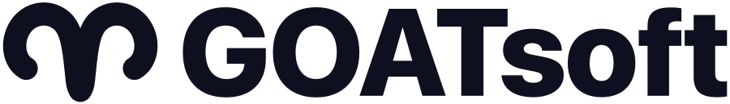

<picture>
  <source media="(prefers-color-scheme: dark)" srcset="./goatsoft-logo-dark.png">
  
</picture>

### GOATed software, built in the open. 🐐

Native macOS software that respects the people who use it: private by default, fast on the hardware you already own, and open source with no hidden agendas.

Everything we ship is public, right here. Read the source, fork it, build it, and tell us where it falls short.

## What we are building

<table>
<tr>
<td width="50%" valign="top">

### [GOAT](https://github.com/goatsoft/GOAT)

A private AI workspace for Mac. Connect local models to your project files, tools and memory, with permissions you control.

Read more at [goatapp.dev](https://goatapp.dev)

</td>
</tr>
</table>

> The badges above read live from GitHub, so stars, releases and activity stay current on their own.

## How we work

- 🔒 **Private by design**: no accounts, no telemetry, no surprise network calls. Your data stays on your device unless you choose otherwise.
- 🐐 **Native first**: built for the platform, not around it. Swift on the Mac, the right framework for each job.
- 📖 **Open source**: every product ships with its source, its decisions, and its licence. Issues, discussions and pull requests are the front door.
- ⛰️ **Built to last**: small, deliberate releases with architecture decision records behind them, so the reasoning outlives the code.

## Get involved

- ⭐ Star a project you like. It genuinely helps.
- 🐛 Open an issue when something is broken or missing.
- 💬 Start a discussion to ask questions or share what you are building.
- 🔧 Send a pull request. Small, focused changes are the easiest to merge.

## Find us

- 🌐 Website: [goatsoft.io](https://goatsoft.io)
- 📚 Docs: [goatherd.dev](https://goatherd.dev)
- 💬 Say hello through the contact form on [goatsoft.io](https://goatsoft.io)

GOATed software, built in the open.
